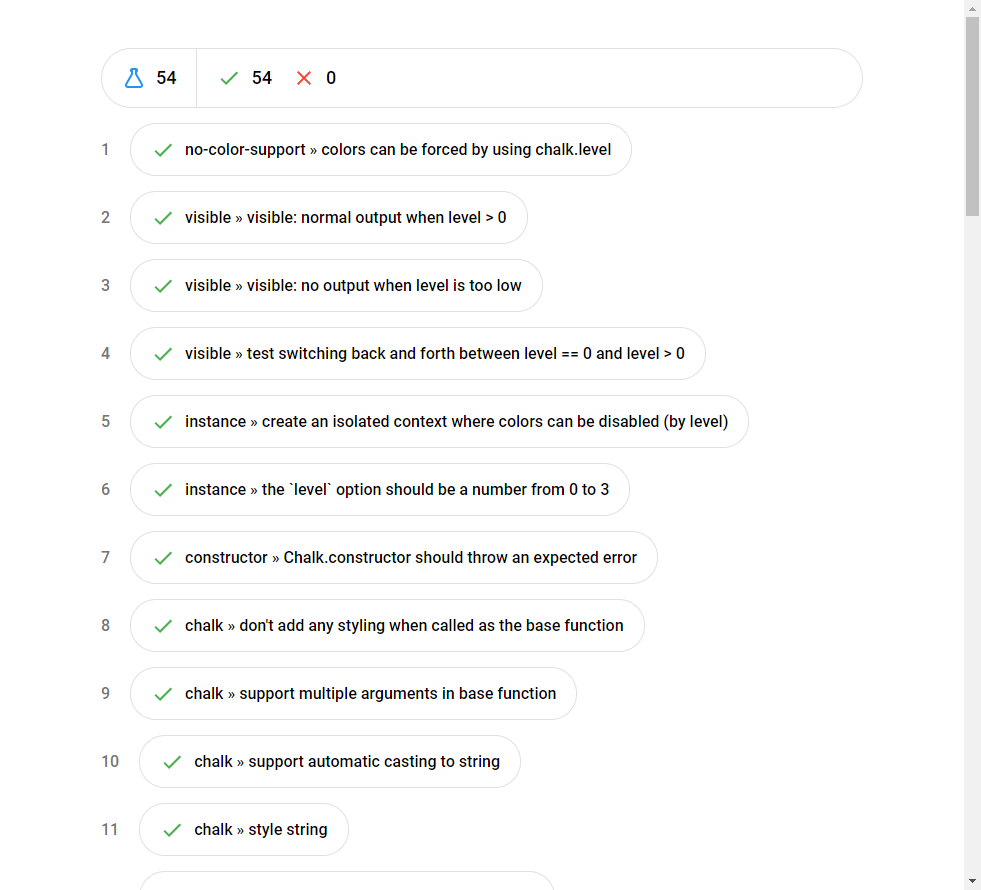

# taplet [](https://travis-ci.com/Richienb/taplet)

Create HTML from TAP reports.

[](https://npmjs.com/package/taplet)

## Install

```sh
npm install --global taplet
```

## Usage

```
$ tape test.js | taplet
<!DOCTYPE html>...

$ tape test.js | taplet --outputFile report.html
```

## Example output


